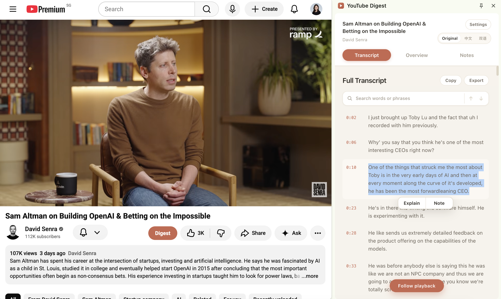
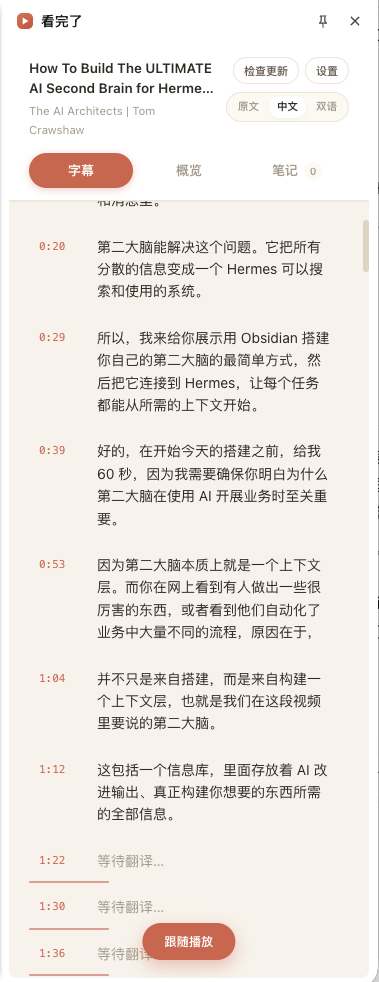
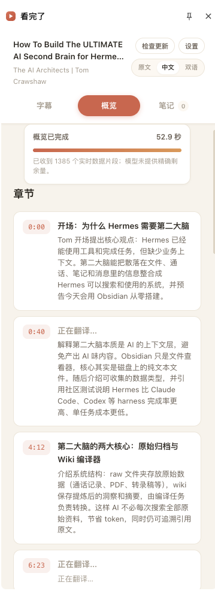
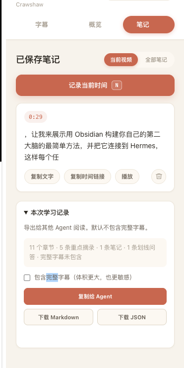
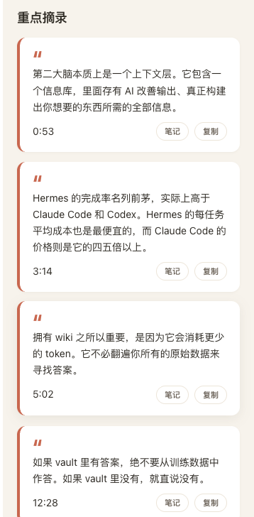
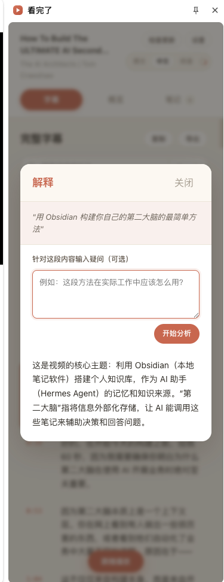
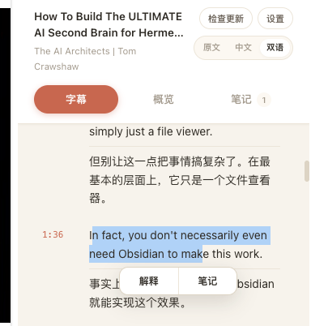
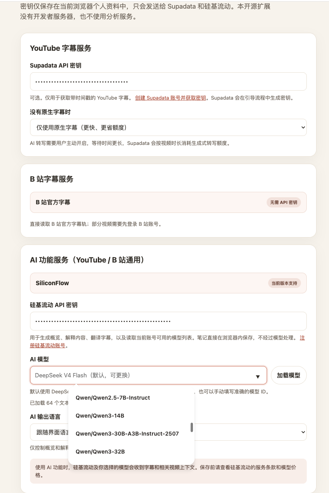
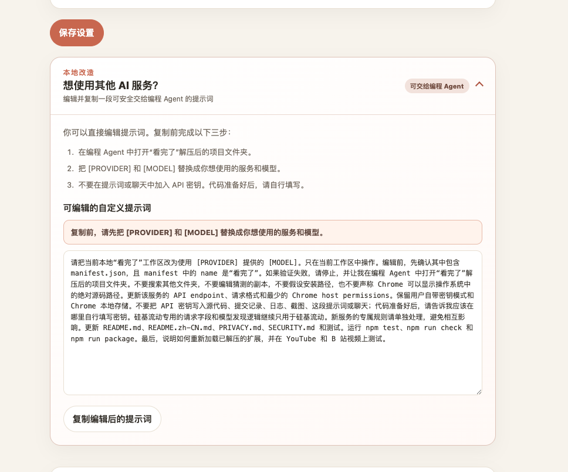
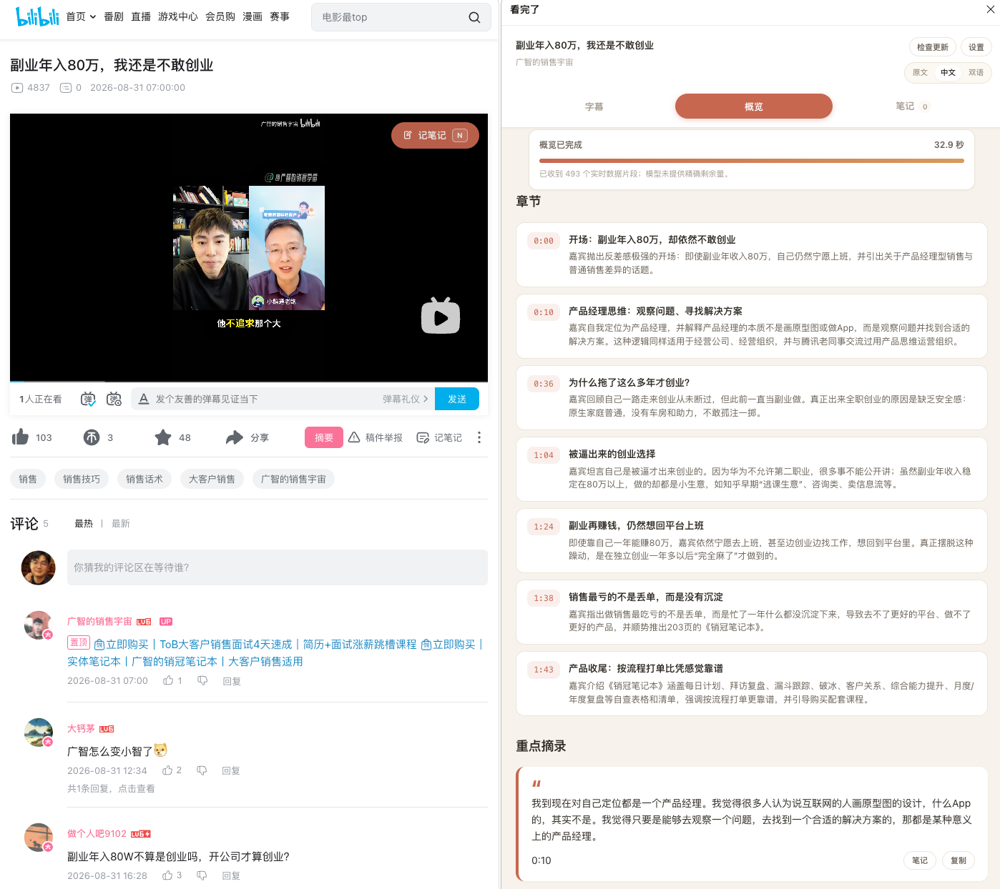

# KanWanLa

[中文](README.md) | [English](README.en.md)

> Long video? KanWanLa finds the parts worth keeping.

**KanWanLa – AI Video Learning Assistant**

Turn YouTube and Bilibili videos into learning material with timestamped transcripts, bilingual reading, SiliconFlow-powered overviews, explanations, and notes.

KanWanLa is a local, bring-your-own-key Chromium extension for Chrome and Edge. It has no developer-operated backend, account system, analytics, advertising, or included API credits, and it requires no local server.

> [!IMPORTANT]
> KanWanLa is a derivative work based on [zarazhangrui/youtube-digest](https://github.com/zarazhangrui/youtube-digest), used under the MIT License. This independently maintained fork preserves the upstream copyright notice and adds Bilibili support, SiliconFlow model selection, Chrome and Edge compatibility, and reliability improvements.

For faster access from mainland China, releases are mirrored on [GitCode](https://gitcode.com/gcw_XQNnjJtX/kanwanla). [GitHub](https://github.com/Zhenxiangai/kanwanla) remains the primary source repository, issue tracker, and fallback download host.



## What changed in v2.2.0

| Change | Why it matters to users |
| --- | --- |
| The extension, repositories, and ZIP files now share the KanWanLa name | Downloads and installed copies are easier to identify. |
| Pre-v2.2 local data is migrated automatically | Existing settings, notes, annotations, and learning-record revisions remain available. |
| The project home now explains the value of every release | Users can understand an update before installing it. |
| GitCode and GitHub links use the new repository name | Mainland-China downloads keep their fast path and GitHub remains the fallback. |

See the Chinese-first [version history](CHANGELOG.md) for earlier user-facing improvements.

## How this fork differs from the reference projects

KanWanLa is derived from [zarazhangrui/youtube-digest](https://github.com/zarazhangrui/youtube-digest), while its Bilibili integration also adapts ideas from [biuworks/bilibili-digest](https://github.com/biuworks/bilibili-digest).

| Area | Original YouTube project | Bilibili reference project | KanWanLa |
| --- | --- | --- | --- |
| Platforms | YouTube | Bilibili | YouTube and Bilibili in one extension. |
| Missing YouTube captions | Native captions only | Not applicable | Optional user-enabled Supadata AI transcription fallback. |
| AI models | Fixed DeepSeek V4 Flash | User-provided model service | SiliconFlow DeepSeek V4 Flash by default, with model discovery and manual selection. |
| Questions | Explain selected text | Selection explanations plus whole-video Q&A | Add a specific question to selected text for a targeted answer. |
| Notes and exports | Timestamped notes | Editable/searchable notes and study exports | Shared click/`N` capture on both sites, real save receipts, and Agent/Markdown/JSON learning records. |
| Updates | Manual GitHub download | Chrome and Edge store updates | Visible in-panel checks with GitCode-first and GitHub fallback downloads. |

This is not a ranking. The Bilibili reference currently includes capabilities such as whole-video Q&A, editable notes, and store distribution that KanWanLa does not claim to replace. This comparison reflects the public project documentation checked on 2026-09-01.

## Interface and feature showcase

These screenshots come from real use on YouTube. Read transcripts, generate an AI overview, capture highlights, ask about selected text, and keep notes without leaving the video page.

<table>
  <tr>
    <td width="33%" align="center" valign="top">
      <strong>Timestamped transcript and translation</strong><br><br>
      <br>
      <sub>Seekable cues, original/Chinese/bilingual views, search, and playback following.</sub>
    </td>
    <td width="33%" align="center" valign="top">
      <strong>AI overview with honest progress</strong><br><br>
      <br>
      <sub>See the active stage, elapsed time, and streaming activity while chapters are generated.</sub>
    </td>
    <td width="33%" align="center" valign="top">
      <strong>Notes and Agent export</strong><br><br>
      <br>
      <sub>Manage timestamped notes, copy a learning record for an Agent, or export Markdown and JSON.</sub>
    </td>
  </tr>
</table>

<table>
  <tr>
    <td width="50%" align="center" valign="top">
      <strong>Key highlights</strong><br><br>
      <br>
      <sub>Keep seekable timestamps, copy a highlight, or turn it directly into a note.</sub>
    </td>
    <td width="50%" align="center" valign="top">
      <strong>Selection explanation and targeted questions</strong><br><br>
      <br>
      <sub>Add your own question so the AI analyzes selected text in the video's context.</sub>
    </td>
  </tr>
</table>

<table>
  <tr>
    <td width="50%" align="center" valign="top">
      <strong>Visible note confirmation</strong><br><br>
      <br>
      <sub>Immediately see the actual saved excerpt and its timestamp link.</sub>
    </td>
    <td width="50%" align="center" valign="top">
      <strong>Selection shortcuts</strong><br><br>
      <br>
      <sub>Explain or save selected transcript text directly from the inline toolbar.</sub>
    </td>
  </tr>
</table>

### Service configuration and cross-platform experience

<table>
  <tr>
    <td width="50%" align="center" valign="top">
      <strong>Transcript services and AI model selection</strong><br><br>
      <br>
      <sub>Supadata serves YouTube while Bilibili uses official captions. SiliconFlow defaults to DeepSeek V4 Flash while preserving model and output-language choices.</sub>
    </td>
    <td width="50%" align="center" valign="top">
      <strong>An editable development prompt for Agents</strong><br><br>
      <br>
      <sub>Edit and copy a project-aware prompt with explicit safety boundaries to add another AI service or continue development with an Agent.</sub>
    </td>
  </tr>
</table>

<p align="center">
  <strong>Full Bilibili side-panel experience</strong><br><br>
  <br>
  <sub>Open KanWanLa directly on a Bilibili video to generate timestamped chapters and highlights with the same notes, language, and update controls.</sub>
</p>

## What this fork adds

- Bilibili video and multipart-video support using Bilibili's official web APIs.
- SiliconFlow as the AI provider, defaulting to DeepSeek V4 Flash while retaining account model discovery and manual model-ID selection.
- Tested Chrome and Edge support for both supported video platforms.
- Faster long Bilibili overviews through cue grouping, bounded input, a smaller reasoning budget, and retryable timeout handling.
- Platform-aware transcript caching, Chinese-caption passthrough, and independent multipart-video data.
- Chinese-first release alerts with version numbers, concise notes, GitCode-first downloads, and an automatic GitHub fallback.
- An always-visible **Check updates** control in the panel header that bypasses the automatic-check cache and continues directly into the update flow when a release is found.
- A Chinese-first interface with browser-following or fixed-English options, plus an independent AI output-language setting.
- Reliable notes from the video button, `N` shortcut, and side panel, with the actual saved excerpt shown immediately.
- Optional questions for selected-text explanations and honest Overview stage, elapsed-time, and streaming-activity progress.
- Agent-ready session export as a copyable prompt, Markdown, or JSON, excluding the full transcript by default.

## Supported sites

- **YouTube:** standard watch pages. Supadata retrieves native captions, with an explicitly enabled AI-transcription fallback for videos without them.
- **Bilibili:** `/video/` and `/list/` playback pages, including multipart videos. Subtitle metadata and files are retrieved from Bilibili's official web APIs.

YouTube keeps its historical cache and note identifiers. Every Bilibili part uses a namespaced cache key, so multipart videos remain independent.

## Features

- Read a seekable transcript beside the player and follow playback automatically.
- Click a transcript row, chapter, quote, or note to seek.
- Switch between original, Chinese, and aligned bilingual views.
- Display Chinese source captions directly without redundant translation requests.
- Translate in larger semantic batches to reduce serial waits on long videos.
- Generate chapters and key quotes only when Overview is opened.
- Explain selected transcript text, optionally with a question for a targeted answer.
- Save timestamped notes from the video Note button, `N`, or the side panel and immediately see what was persisted.
- See real Overview stages, elapsed time, and streaming activity without a fabricated remaining-time estimate.
- Use DeepSeek V4 Flash by default, load another model available to a SiliconFlow account, or enter a model ID manually.
- Use Chinese by default, follow the browser, or choose English; configure AI output language independently.
- Cache transcripts, translations, analysis, reading position, selection Q&A, and notes in browser-local extension storage.
- Copy the current learning record for an Agent or download Markdown/JSON; the full transcript requires explicit opt-in.
- Run entirely in the extension, without Whisper, a companion app, or a developer backend.

## Requirements

- Chrome or Edge 116 or later.
- A SiliconFlow API key for AI features. DeepSeek V4 Flash is the default model and can be changed.
- A Supadata API key for YouTube transcript retrieval.
- For Bilibili tracks visible only to signed-in users, a normal Bilibili login in the same browser profile.

Never put API keys in chat, source files, screenshots, logs, or commits. Enter them only on the extension's Settings page.

## Install

1. Download the latest ZIP from [GitCode Releases](https://gitcode.com/gcw_XQNnjJtX/kanwanla/releases). If GitCode is temporarily unavailable, use the [GitHub fallback release](https://github.com/Zhenxiangai/kanwanla/releases/latest). Extract it to a permanent folder.
2. Open `chrome://extensions` in Chrome or `edge://extensions` in Edge.
3. Enable **Developer mode** and click **Load unpacked**.
4. Select the folder containing `manifest.json`.
5. Open KanWanLa Settings, enter your own API keys, and save. Keep the default DeepSeek V4 Flash model or load another SiliconFlow model.
6. Refresh any YouTube or Bilibili tabs that were already open.

## Updates

- **Check updates** is always visible at the top of the panel content. Clicking it performs an immediate network check instead of waiting for the 24-hour automatic-check cache. If a release is found, the control changes to **New vX** and the same click continues into the update flow. Dismissing detailed release notes does not hide this control.
- **Unpacked install:** extensions cannot safely overwrite their own source directory. Updating opens a validated [GitCode release](https://gitcode.com/gcw_XQNnjJtX/kanwanla/releases), with GitHub used only if GitCode is unavailable. Extract it over the existing folder, click **Reload** on the extension card, and refresh the video page.
- **A future store install:** the browser remains responsible for installing updates. The control only asks the browser to check its corresponding store and apply a downloaded update. KanWanLa is not currently listed in Chrome Web Store or Edge Add-ons.

The automatic release check runs at most once every 24 hours. It reads public metadata from GitCode first and falls back to GitHub if necessary. It never sends API keys, video URLs, transcripts, notes, or account data. A failed check does not block any video feature.

## Transcript sources

### YouTube

KanWanLa sends a canonical YouTube watch URL to Supadata's transcript endpoint. The default `mode=native` reads existing captions only and reports when none are available. Users may explicitly enable **Use Supadata AI transcription as fallback** in Settings; this selects `mode=auto`, which tries native captions before asking Supadata to generate a transcript. Generated transcription is slower and consumes Supadata credits by video duration, so it is never enabled by default.

### Bilibili

KanWanLa uses this sequence:

1. `api.bilibili.com/x/web-interface/view` resolves the BV number and selected part to its aid and cid.
2. `api.bilibili.com/x/player/wbi/v2` returns subtitle tracks using Bilibili's WBI signature.
3. The selected subtitle JSON is downloaded from a Bilibili `hdslb.com` host.

Bilibili API requests may include the browser's existing Bilibili cookies so tracks available to the signed-in user can be listed. Subtitle CDN downloads omit cookies. The extension does not request the Chrome `cookies` permission and never reads or stores cookie values itself.

Track preference is human Chinese, AI Chinese, then English. If no subtitle track is exposed by Bilibili, KanWanLa reports that no transcript is available; it does not create one from the media stream.

For unpunctuated Chinese AI captions returned by Bilibili, KanWanLa conservatively adds comma, sentence, and paragraph boundaries in the browser. Existing punctuation is preserved, and this formatting does not send the caption text to another service.

## SiliconFlow

If you do not have an account, use the [SiliconFlow signup link](https://cloud.siliconflow.cn/i/w3LDYnbF).

The AI endpoint is fixed to `https://api.siliconflow.cn/v1`. Settings loads text-chat model suggestions from:

```text
GET /v1/models?type=text&sub_type=chat
```

The default model ID is `deepseek-ai/DeepSeek-V4-Flash`. A valid model selected or entered by the user is retained instead of being replaced by the default. The selected model is used for overviews, explanations, and non-Chinese-to-Chinese translation. Chinese source captions bypass translation. Notes are persisted locally without waiting for a model.

Overview generation uses SiliconFlow SSE streaming. For long Bilibili transcripts with many short cues, the extension first groups adjacent cues; if the result is still too large, it retains evenly spaced timestamped sections across the whole video while explicitly preserving the beginning and end. Bilibili overviews also use smaller input, reasoning, and output budgets to reduce latency. Existing YouTube analysis budgets are unchanged. The side panel reports actual preparation, request, generation, validation, and completion stages together with elapsed time and received stream chunks. It does not invent a countdown because the provider exposes no precise remaining-time signal. A bounded watchdog turns interrupted requests into retryable errors.

Model availability, pricing, rate limits, and context limits vary. Review the current SiliconFlow console before selecting a model.

## Supadata

YouTube transcripts require your own Supadata API key. Use the [Supadata signup link](https://supadata.ai/?ref=xiang) to create an account and obtain a key. The key and no-caption preference stay in your current browser profile. Native-only mode is faster and uses fewer credits; the optional AI fallback can take longer and consumes generated-transcript credits by video duration.

## Learning records and Agents

Expand **Learning record** in the Notes tab to copy an Agent-ready prompt or download the same normalized record as Markdown or JSON. It includes the source, overview, key excerpts, saved notes, and selection Q&A. A stable `recordId` plus increasing `revision` lets an Agent update the same record idempotently.

The full transcript is excluded by default and appears only after the user explicitly enables it. Assembly happens inside the extension. KanWanLa does not connect to Hermes, upload the record to a developer server, or send it to an Agent automatically.

## Bilibili limitations

- Only subtitle tracks exposed by Bilibili are supported.
- Some AI subtitle tracks require a Bilibili login.
- Bilibili risk control may temporarily reject requests; open the video normally, wait, and retry.
- If player selectors change, the extension falls back to floating Digest and Note buttons.

## Local data

Settings, language preferences, transcripts, translations, overviews, notes, selection Q&A, learning-record revision metadata, reading positions, and the last update-check time stay in the current browser profile. Use **Clear cached digests** or **Reset extension data** in Settings when needed. See [PRIVACY.md](PRIVACY.md) for the complete data flow.

## Development

The extension uses plain HTML, CSS, and JavaScript with no build step.

```bash
npm test
npm run check
npm run package
```

The package command validates the release allowlist, JavaScript syntax, tests, local references, and common credential patterns before creating `dist/kanwanla-v<version>.zip`.

## Attribution

KanWanLa is based on [zarazhangrui/youtube-digest](https://github.com/zarazhangrui/youtube-digest), created by Zara Zhang and used under the MIT License. It is independently maintained at [Zhenxiangai/kanwanla](https://github.com/Zhenxiangai/kanwanla) and mirrored to [GitCode](https://gitcode.com/gcw_XQNnjJtX/kanwanla); issues about this version should be reported here rather than to the upstream project.

The Bilibili WBI signer, subtitle API flow, and hydration-safe page injection strategy are adapted from [biuworks/bilibili-digest](https://github.com/biuworks/bilibili-digest), also used under the MIT License.

The original and adapted copyright notices are preserved in [LICENSE](LICENSE), [NOTICE](NOTICE), and the relevant source files. This project remains licensed under the [MIT License](LICENSE).
